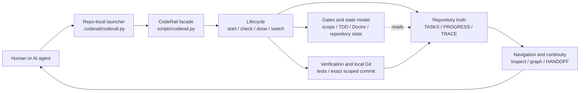

# CodeRail — Convergent Coding

[English](README.md) | [简体中文](README.zh-CN.md)


**Spec is the output, not the input.**

Vibe coding explores; CodeRail converges. As you build, discover, and change your mind, the tool quietly turns what you learned into guardrails — so exploration compounds instead of unravelling. Your AI assistant stops drifting, stops declaring victory too early, and always leaves a state the next session can pick up.

No server. No accounts. No new methodology to learn. Just three commands and a `docs/` folder that stays honest.

If you are new to programming and want to understand what CodeRail solves, what it does during development, and how it works with Spec Kit, grill-me, and Superpowers, read [What CodeRail is: project governance for vibe coders (Simplified Chinese)](docs/CODERAIL_FOR_VIBE_CODERS_ZH.md).

## How CodeRail fits together



The launcher connects a project to the CodeRail home. The lifecycle facade checks scope and evidence, updates plain-text repository truth, and commits only the exact safe task files. Detailed system, lifecycle, closeout, and state authority diagrams are in [`docs/CODERAIL_DIAGRAMS.md`](docs/CODERAIL_DIAGRAMS.md).

## 60-second start

```bash
# 1. Get CodeRail and install it into your project
git clone https://github.com/HaipingShi/coderail
python3 coderail/scripts/init_project.py --target /path/to/your/project

# 2. In your project, work with three commands
python .coderail/coderail.py start "add a login page"   # begin a task
python .coderail/coderail.py check                      # am I on track?
python .coderail/coderail.py done --owner-locale en     # finish safely
```

That is the whole interface. Your AI assistant reads the installed `AGENTS.md` and follows the same three commands automatically.

## What each command does

**`start "..."`** — records what you are about to do, which files it may touch, and how you will know it is finished. This one step is what prevents scope creep and "wait, what was I doing?" later.

**`check`** — answers "am I on track?" in plain language: what is active, what is missing, whether you could finish right now.

**`done`** — the safety net. It verifies tests/checks pass (or you explicitly recorded a manual check), confirms changes stayed inside the promised files, syncs the docs, commits only the safe task-related files, and tells you the next step. If something is off, it refuses and says exactly what to fix. An AI assistant cannot talk its way past it.

`inspect` and `check` are read-only. They report structured diagnostics with a
severity, category, blocking stage, evidence, and recommended action. Stale
handwritten lifecycle prose is `projection_staleness`: it may be cleaned up in
a maintenance batch, but it does not block product formulation or create a new
governance task. Exact machine-marker conflicts, scope violations, and failed
verification still block the relevant lifecycle stage.

Generated snapshots are synchronized explicitly:

```bash
python .coderail/coderail.py sync-projections          # preview, zero writes
python .coderail/coderail.py sync-projections --apply  # write listed projections
```

`inspect` is the Agent Blackboard: it leads with control-plane state,
diagnostics, exact evidence references, and recovery actions. It never presents
NORTH_STAR goals as verified product capability. Read the separate owner view
without changing repository state:

```bash
python .coderail/coderail.py owner-summary --locale zh-CN
```

No extra commit-approval question is needed after those gates pass: successful `done` is already permission for one exact local task commit. Use `--no-commit` only when you explicitly want to review the diff first. Push, tag, and release always remain separate user decisions.

For owner delivery, a task may add an explicit structured Delivery Contract.
`done --owner-locale zh-CN` emits only a localized three-to-six-sentence Owner
Receipt; necessary English must be annotated, while task IDs, paths, lifecycle
jargon, commits, and safe-file lists remain in the Agent Blackboard and
Technical Report. The same normalized facts are appended to tracked
`docs/DELIVERIES.jsonl`, so product evidence survives hot-TASKS compaction and a
fresh clone without becoming lifecycle authority. The owner language is now
required; CodeRail never guesses it and no longer has the legacy seven-section
fallback. Task finalization never implies milestone or product completion. See
[`references/DELIVERY_CONTRACT.md`](references/DELIVERY_CONTRACT.md).

Task scope is fail-closed. If one path matches both an Allowed rule and a Forbidden rule, `start`, `switch`, or closeout reports `SCOPE_CONTRADICTION` with the exact path and both rules. Allowed never silently overrides Forbidden; narrow the forbidden glob before continuing.

If verification passes but the exact Git commit cannot run, CodeRail preserves the complete safe-file snapshot as `verified-commit-pending`. Restore Git permission and run `coderail done --resume --owner-locale en` (or `zh-CN`), or manually commit only the exact files printed by CodeRail and then run the same resume command. Use `coderail done --no-commit --owner-locale en` to choose this manual mode from the beginning. Resume never reruns verification or duplicates PROGRESS/TRACE entries.

## Switching tasks safely

`start` and `next --go` refuse to create ambiguous ownership. Use the explicit switch gate when work must branch:

```bash
python .coderail/coderail.py switch "new task" --owner-locale en              # close and commit the accepted source first
python .coderail/coderail.py switch "new task" --checkpoint --owner-locale en # commit a verified checkpoint, then pause it
python .coderail/coderail.py switch "new task" --dirty-fork # explicit waiver: carry a fingerprinted dirty baseline
python .coderail/coderail.py switch --to T-012 --owner-locale en # close any active source, then resume the destination
```

If current work is not safely committable, CodeRail writes an H3 handoff and requires `switch --continue-current` or an explicit `--dirty-fork`. Pre-existing dirty files are recorded by path, Git state, and SHA-256 fingerprint so unchanged work is not attributed to the new task. Auto-commit never means auto-push.

## Why "Convergent Coding"

Vibe coding is fast and creative — until the project grows. Then docs rot, the assistant drifts from the goal, sessions forget each other, and "done" stops meaning done. The usual fix is spec-driven development: write the spec first, then build. But that assumes you already know what you want — and vibe coders discover what they want *by building*. Spec-first is not too hard for them; it points the wrong way.

Convergent Coding inverts the arrow. You explore freely; each time something proves true — a task verified, a decision made, a boundary learned — the tool records it as a constraint the next round of exploration must respect. The spec accumulates behind you instead of blocking the road ahead. Exploration stays free; the project stops oscillating and starts converging. When repeated fixing fails to converge, the tool says so and points one level up: rethink the design, or rethink the goal.

In short: discipline runs automatically behind three plain commands. You never write a spec; the tool quietly maintains one for you (goal, task list, decision log, change history) and refuses to let anyone — human or AI — skip verification.

## What lives in your repo

```text
your-project/
├── AGENTS.md            # plain-language rules your AI assistant follows
├── .coderail/           # the single entry command
└── docs/
    ├── NORTH_STAR.md    # what you are building, one page
    ├── TASKS.md         # every task: goal, files, how it was verified
    ├── DECISIONS.md     # why things are the way they are
    ├── HANDOFF.md       # how the next session picks up
    └── TRACELOG.jsonl   # append-only history linking changes to reasons
```

Plain text, all in git, nothing hidden. Delete the folder and CodeRail is gone.

## Zero dependencies

Pure Python 3 standard library. Works with Codex, Claude Code, and any agent that reads `AGENTS.md` / `CLAUDE.md`.

## Advanced

The three commands are a facade over a deeper kernel: verification gates, TDD evidence, drift detection, deterministic drive decisions for long-running autonomous sessions, architecture blueprints, and trace graphs. Power users can call these directly:

```bash
python .coderail/coderail.py --help    # lists advanced commands
python .coderail/coderail.py why T-046
python .coderail/coderail.py impact docs/BLUEPRINTS.md
python .coderail/coderail.py graph T-046
python .coderail/coderail.py candidate list
```

The idea behind the tool — Convergent Coding — is written up in [`references/CONVERGENT_CODING.md`](references/CONVERGENT_CODING.md). Deep documentation lives in [`references/`](references/). Install details in [`INSTALL.md`](INSTALL.md). Skills for Claude Code / Codex live in [`skills/`](skills/).

## License

MIT
