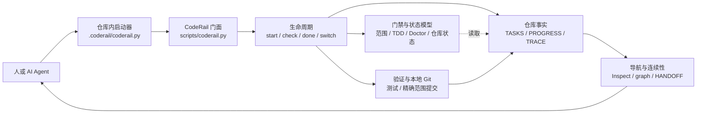

# CodeRail — 收敛式编码

[English](README.md) | [简体中文](README.zh-CN.md)


**Spec 是产出，不是前提。**

Vibe coding 负责发散探索，CodeRail 负责收敛。你一边做、一边发现、一边改主意，工具在背后把你学到的东西悄悄追认为护栏——让探索层层累积，而不是层层瓦解。你的 AI 助手不再跑偏、不再过早宣布完成，并且永远留下下一个会话能接得住的项目状态。

没有服务端、不需要账号、不用学任何新方法论。只有三个命令，和一个不会说谎的 `docs/` 目录。

如果你不懂编程，想先理解 CodeRail 解决什么问题、开发过程中会做哪些动作，以及怎样与 Spec Kit、grill-me 和 Superpowers 配合，请阅读 [CodeRail 是什么：给 Vibe Coder 的项目治理说明](docs/CODERAIL_FOR_VIBE_CODERS_ZH.md)。

## CodeRail 总览



仓库内启动器负责连接 CodeRail 内核；生命周期门面检查范围和证据，把事实写回纯文本账本，并且只提交当前任务的精确安全文件。系统架构、生命周期、收口事务和状态权威详图见 [`docs/CODERAIL_DIAGRAMS.md`](docs/CODERAIL_DIAGRAMS.md)。

## 60 秒上手

```bash
# 1. 获取 CodeRail，并安装到你的项目
git clone https://github.com/HaipingShi/coderail
python3 coderail/scripts/init_project.py --target /path/to/your/project

# 2. 在项目中使用三个命令
python .coderail/coderail.py start "添加登录页面"   # 开始任务
python .coderail/coderail.py check                  # 检查是否跑偏
python .coderail/coderail.py done                   # 安全完成
```

这就是全部界面。你的 AI 助手会读取安装好的 `AGENTS.md`，自动遵循同样的三个命令。

## 三个命令做什么

**`start "..."`** — 记下你要做什么、会动哪些文件、怎么算完成。就这一步，避免了范围蔓延和“我刚才在干嘛来着”。

**`check`** — 用大白话回答“我现在没跑偏吧”：当前任务是什么、还缺什么、现在能不能收尾。

**`done`** — 安全网。它验证测试通过（或你明确记录了人工检查）、确认改动没超出承诺的文件、同步文档、只提交安全的任务相关文件，然后告诉你下一步。有问题它会拒绝并明确说出要修什么——AI 助手无法用话术绕过它。

这些门禁全部通过后，不再要求用户额外判断是否提交：成功运行 `done` 就已经授权一次精确的本地任务提交。只有你明确要求“提交前先看 diff”时才使用 `--no-commit`；push、tag 和 release 始终是独立的用户决策。

面向客户交付时，任务可以增加显式的结构化 Delivery Contract。成功收口后，CodeRail 会另外生成客户 Markdown：先说交付结果和能力变化，commit、验证和精确 safe files 只放在最后的技术附录。任务 finalized 不会自动推导里程碑或产品 completed；缺少合同的历史任务保持 `not_assessed`。详见 [`references/DELIVERY_CONTRACT.md`](references/DELIVERY_CONTRACT.md)。

任务范围采用 fail-closed：同一路径同时命中 Allowed 与 Forbidden 时，`start`、`switch` 或收口会输出 `SCOPE_CONTRADICTION`、精确路径以及两条冲突规则。Allowed 不会静默覆盖 Forbidden；继续前必须收窄禁止规则。

如果验证已通过但精确 Git 提交因权限等原因无法执行，CodeRail 会保留完整 safe-file snapshot，并进入 `verified-commit-pending`。权限恢复后运行 `coderail done --resume`；也可以只按输出的精确文件清单人工提交，再运行同一恢复命令。若从一开始就选择人工提交，使用 `coderail done --no-commit`。恢复不会重跑验证，也不会重复写入 PROGRESS/TRACE。

## 安全切换任务

`start` 和 `next --go` 不允许产生模糊归属。任务必须分支时，使用明确的切换门禁：

```bash
python .coderail/coderail.py switch "新任务"              # 先关闭并提交已验收的来源任务
python .coderail/coderail.py switch "新任务" --checkpoint # 提交已验证检查点，然后暂停
python .coderail/coderail.py switch "新任务" --dirty-fork # 明确豁免：携带带指纹的脏基线
python .coderail/coderail.py switch --to T-012            # 恢复暂停或排队的任务
```

如果当前工作不能安全提交，CodeRail 会写入 H3 handoff，并要求使用 `switch --continue-current` 或明确的 `--dirty-fork`。已有脏文件会按路径、Git 状态和 SHA-256 指纹记录，因此未变化的工作不会被归给新任务。自动提交永远不等于自动推送。

## 为什么叫“收敛式编码”

Vibe coding 又快又自由——直到项目变大。然后文档腐烂、助手偏离目标、会话之间互相失忆、“完成”不再意味着真的完成。常规解法是 spec 驱动开发：先写规格、再动手。但它假设你早就知道自己要什么——而 vibe coder 恰恰是**做出来才知道要什么**。spec 前置对他们不是太难，是方向反了。

收敛式编码把箭头倒过来。你自由探索；每当一件事被证实——一个任务通过验证、一个决策被做出、一条边界被踩明白——工具就把它记录为下一轮探索必须尊重的约束。spec 在你身后累积，而不是挡在你前面。探索依旧自由，项目却不再震荡、开始收敛。当反复修补无法收敛时，工具会直说，并把你的注意力抬高一层：重新想设计，或者重新想目标。

一句话：纪律在三个命令背后自动运行。你从不写 spec，工具在背后悄悄替你维护（目标、任务清单、决策记录、变更历史），并且拒绝让任何人——无论人类还是 AI——跳过验证。

## 装进仓库的是什么

```text
你的项目/
├── AGENTS.md            # AI 助手遵循的自然语言规则
├── .coderail/           # 唯一入口命令
└── docs/
    ├── NORTH_STAR.md    # 一页说明你在构建什么
    ├── TASKS.md         # 每项任务的目标、文件和验证方式
    ├── DECISIONS.md     # 记录设计原因
    ├── HANDOFF.md       # 下个会话如何接手
    └── TRACELOG.jsonl   # 将变更与原因关联的追加式历史
```

全是纯文本、全在 Git 里、没有黑盒。删掉目录，CodeRail 就卸载了。

## 零依赖

只使用 Python 3 标准库。适配 Codex、Claude Code，以及任何会读取 `AGENTS.md` / `CLAUDE.md` 的 Agent。

## 进阶

三个命令是一层门面，背后是完整内核：验证门禁、TDD 证据、漂移检测、长时自主会话的确定性推进决策、架构图纸和追踪图谱。进阶用户可以直接调用：

```bash
python .coderail/coderail.py --help    # 列出进阶命令
python .coderail/coderail.py why T-046
python .coderail/coderail.py impact docs/BLUEPRINTS.md
python .coderail/coderail.py graph T-046
python .coderail/coderail.py candidate list
```

工具背后的思想——收敛式编码——完整阐述见 [`references/CONVERGENT_CODING.md`](references/CONVERGENT_CODING.md)。深度文档见 [`references/`](references/)，安装细节见 [`INSTALL.md`](INSTALL.md)，Claude Code / Codex 的 skills 见 [`skills/`](skills/)。

## 许可证

MIT
