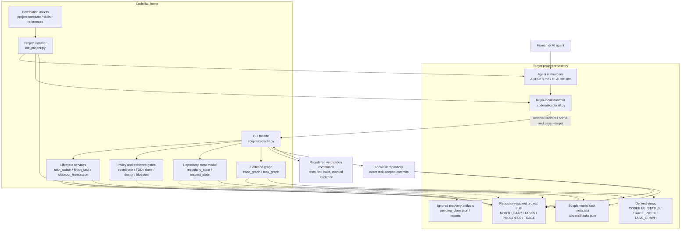
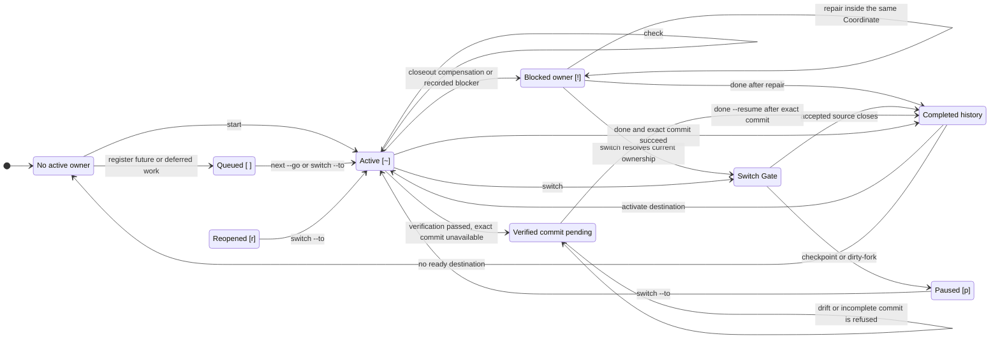

# CodeRail Architecture and Lifecycle Diagrams

Status: current  
Owner: CodeRail  
Updated: 2026-07-28  
Task: T-051

These diagrams describe the repository as implemented. They are maintenance
maps, not a proposal for a future architecture. File ownership follows
ADR-011 and ADR-012: hot task ownership, completed history, trace facts,
derived status, and recovery state remain separate.

## 1. System Architecture and Component Boundaries

CodeRail has two runtime boundaries: a small launcher installed in the target
repository and the CodeRail home that contains the Python kernel. All durable
project truth stays in the target repository.



Boundary rules:

- The launcher locates CodeRail; it does not own lifecycle behavior.
- `scripts/coderail.py` is the user-facing facade and orchestration entry.
- Specialized modules own repository classification, task switching,
  inspection, graph queries, and the closeout transaction model.
- Verification commands and Git are subprocess boundaries. CodeRail never
  pushes automatically.
- Project truth is plain repository data; ignored recovery artifacts cannot
  become the sole historical authority.

## 2. Task Lifecycle State Machine

The state machine shows ownership, not every internal check. `[~]` and `[!]`
both count as the current owner, so `start` cannot create a second active task.



Important invariants:

- Activation is fail-closed when another task owns changes.
- `switch` resolves the source before activating the destination.
- A checkpoint or dirty-fork pauses the source and preserves ownership
  evidence; it does not silently discard work.
- A task is only reported as Done after the exact commit and final consistency
  rescan succeed.
- Completed task bodies may leave hot TASKS only after PROGRESS and verify
  TRACE are durable.

## 3. Done Closeout Sequence

`CloseoutTransaction` is the single success authority. The facade prepares one
source-plus-ledger snapshot, stages only classified safe paths, and emits
success only after the post-commit Inspect-equivalent rescan.

```mermaid
sequenceDiagram
    autonumber
    actor Owner as Human or AI agent
    participant Facade as coderail done + CloseoutTransaction
    participant Verify as Registered verify commands
    participant Recovery as pending_close.json
    participant Gate as finish_task + gates
    participant Ledger as TASKS / PROGRESS / TRACE / STATUS
    participant Repo as repository_state classifier
    participant Git as Local Git
    participant Inspect as Inspect-equivalent rescan

    Owner->>Facade: coderail done
    Facade->>Verify: run every registered command

    alt Any verification command fails
        Verify-->>Facade: non-zero exit and output tail
        Facade-->>Owner: refuse close; task keeps ownership
    else Verification passes
        Verify-->>Facade: exit 0 evidence
        Facade->>Recovery: snapshot task, acceptance, evidence, and next step
        Facade->>Gate: finish task with --no-auto-commit
        Gate->>Gate: Coordinate, TDD, Done, and closeout preflight

        alt Gate or preflight refuses
            Gate-->>Facade: exact blocking reason
            Facade-->>Owner: no success; repair and rerun done
        else Task state closes
            Gate->>Ledger: mark task and append verify lifecycle facts
            Gate-->>Facade: closed-state facts
            Facade->>Ledger: write Done Report and PROGRESS
            Facade->>Ledger: compact durable TASKS and prepare STATUS
            Facade->>Repo: capture and classify final repository snapshot

            alt Outside, forbidden, sensitive, or ambiguous path exists
                Repo-->>Facade: unsafe path list
                Facade->>Ledger: reopen task as blocked
                Facade-->>Owner: refuse commit with exact paths
            else Snapshot is safe
                Repo-->>Facade: exact safe file list
                Facade->>Recovery: persist verified commit-pending snapshot
                Facade->>Git: git add exact paths; commit with task trailers

                alt Stage or commit fails
                    Git-->>Facade: failure
                    Facade-->>Owner: preserve commit-pending; use done --resume
                else Commit succeeds
                    Git-->>Facade: durable commit
                    Facade->>Recovery: clear recovery snapshot
                    Facade->>Inspect: rescan worktree and projected state

                    alt Residue or blocked projection remains
                        Inspect-->>Facade: inconsistent
                        Facade->>Ledger: reopen task as blocked
                        Facade-->>Owner: no Done claim
                    else Clean and consistent
                        Inspect-->>Facade: consistent
                        Facade-->>Owner: FINALIZED; report Done
                    end
                end
            end
        end
    end
```

The recoverable `verified-commit-pending` state preserves successful
verification without pretending that a commit succeeded. `done --resume`
either retries the same exact snapshot or verifies a manually created exact
commit; it does not rerun verification or duplicate ledger history.

## 4. State Authority and Data Flow

The same task appears in several files for different reasons. The arrows below
show which commands write them and which outputs are derived.

```mermaid
flowchart TB
    subgraph Commands["Lifecycle commands"]
        Start["start / next --go"]
        Check["check / Doctor / Blueprint"]
        Switch["switch"]
        Done["done / done --resume"]
        Inspect["inspect"]
        Queries["why / graph / impact"]
    end

    subgraph Authority["Repository-tracked authority"]
        NorthStar["NORTH_STAR.md<br/>goal and Drive contract"]
        Tasks["TASKS.md<br/>hot ownership and Coordinate"]
        Progress["PROGRESS.md<br/>completed human-readable history"]
        Trace["TRACELOG.jsonl<br/>append-only facts and decisions"]
        Handoff["HANDOFF.md<br/>paused or blocked continuation"]
    end

    subgraph Supplemental["Supplemental and recovery state"]
        Meta[".coderail/tasks.json<br/>verify, acceptance, baseline, relations"]
        Pending["pending_close.json<br/>ignored exact recovery snapshot"]
        Reports[".coderail/reports<br/>ignored detailed Done evidence"]
    end

    subgraph Derived["Derived, rebuildable views"]
        Status["CODERAIL_STATUS.md<br/>Inspect projection"]
        TraceIndex["TRACE_INDEX.md<br/>TRACE index"]
        TaskGraph["TASK_GRAPH.md and graph output<br/>formal relation view"]
    end

    Git["Exact task-scoped Git commit<br/>durability boundary"]

    Start --> Tasks
    Start --> Meta
    Start --> Trace
    Switch --> Tasks
    Switch --> Handoff
    Switch --> Trace

    Check -. reads .-> NorthStar
    Check -. reads .-> Tasks
    Check -. reads .-> Meta
    Check -. reads .-> Trace

    Done --> Pending
    Done --> Reports
    Done --> Tasks
    Done --> Progress
    Done --> Trace
    Done --> Meta
    Done --> Status
    Done --> Git
    Git --> Tasks
    Git --> Progress
    Git --> Trace
    Git --> Meta
    Git --> Status

    Inspect -. reads .-> NorthStar
    Inspect -. reads .-> Tasks
    Inspect -. reads .-> Meta
    Inspect -. reads .-> Progress
    Inspect -. reads .-> Trace
    Inspect -. reads .-> Handoff
    Inspect --> Status

    Trace --> TraceIndex
    Trace --> TaskGraph
    Meta --> TaskGraph
    Queries -. reads .-> Trace
    Queries -. reads .-> Meta
    Queries --> TaskGraph
```



Authority table:

| State | Primary purpose | Historical authority? | Main writers |
|---|---|---|---|
| `NORTH_STAR.md` | Outcome, boundaries, Drive contract | current goal | owner and alignment workflow |
| `TASKS.md` | Active, queued, paused, blocked, or reopened ownership | no | start, next, switch, done |
| `PROGRESS.md` | Compact completed-task journal | yes | done, progress repair |
| `TRACELOG.jsonl` | Verify facts, lifecycle facts, explicit decision edges | yes | lifecycle and link commands |
| `HANDOFF.md` | Cross-session continuation for non-H0 situations | no | switch and handoff workflow |
| `.coderail/tasks.json` | Machine-checkable task contract and recovery detail | supplemental only | lifecycle commands |
| `CODERAIL_STATUS.md` | Point-in-time Inspect projection | no | inspect and done |
| `TRACE_INDEX.md` | Searchable TRACE projection | no | trace index regeneration |
| `pending_close.json` | Exact interrupted-close recovery | no | done and done --resume |

No derived file may overrule its source authority. No ignored recovery file may
become the only record that a completed task or decision existed.
